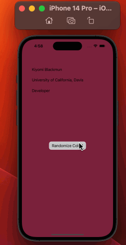

# Codepath iOS Prework

# Pre-work - *background-color-ios*

**background-color-ios** is a background color random generator app for iOS.

Submitted by: **Kiyomi Blackmun**

Time spent: **3** hours

## Required Functionalities

The following **required** functionality is complete:

* [x] User can run application showing a screen with a button and at least a couple of labels.
* [x] The screen has a background color that can changes when the button is tapped.

## Walkthrough of App Display

GIF created with [LiceCap]

## IOS intro Questions

As part of your pre-work submission, please reflect on three apps you use and write a few feautres that stand out to you:

## App BrainStorming

1. TikTok

   a. For You Page

   b. Saved collections feature

2. Pinterest

   a. sliding/saving image as a pin feature

   b. sliding --> send the image through messaging

4. Netflix

   a. automatic skip to next episode + skip intro

   b. 15 sec skip via double tap

**I'd like to work on a makeup app that utilizes an ML API that analyzes the structures of people's faces and makes makeup recommendations based off the angles of their facial features**

## License

    Copyright [2023] [Kiyomi Blackmun]

    Licensed under the Apache License, Version 2.0 (the "License");
    you may not use this file except in compliance with the License.
    You may obtain a copy of the License at

        http://www.apache.org/licenses/LICENSE-2.0

    Unless required by applicable law or agreed to in writing, software
    distributed under the License is distributed on an "AS IS" BASIS,
    WITHOUT WARRANTIES OR CONDITIONS OF ANY KIND, either express or implied.
    See the License for the specific language governing permissions and
    limitations under the License.
